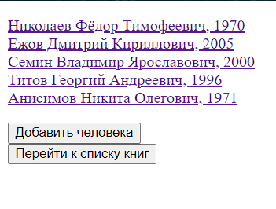
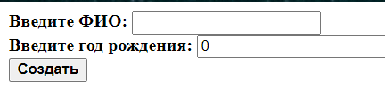
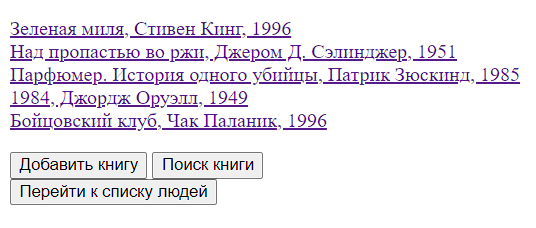
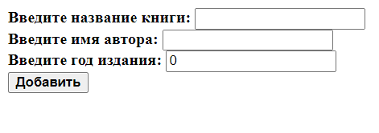
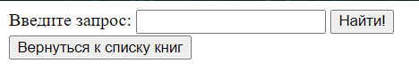
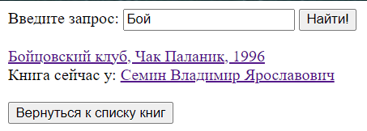

# SpringBootLibrary
### 1. Использованные технологии
* Spring Framework
  * Spring Boot
  * Spring MVC
  * Spring Data JPA
* Веб-представление
  * HTML
  * Thymeleaf

### 2. Структура проекта
#### Controllers:
* PersonController 
* BookController
  
#### __Методы контроллеров:__ </a>

|                 Метод                 |                                          Mapping                                           |                                    Используемые методы                                     |                                                                         Работа метода                                                                          |                                       Возвращаемая страница                                       |
|:-------------------------------------:|:------------------------------------------------------------------------------------------:|:------------------------------------------------------------------------------------------:|:--------------------------------------------------------------------------------------------------------------------------------------------------------------:|:-------------------------------------------------------------------------------------------------:|
|               showAll()               |                                    /people   /books                                    |                    personService.findAll()   bookService.findAll()                     |                                                               Ищет в БД всех клиентов/все книги                                                                |                    Страница со всеми [клиентами](#/people)/[книгами](#/books)                     |
|              showUnit()               |                                        /people/{id}                                        |                  1. personService.findOne(id)   2. person.getBooks()                   |                                                    Ищет в БД клиента по {id} (1) и все взятые им книги (2)                                                     |                                  [Страница клиента](#/people/id)                                  |
|              showUnit()               |                                        /books/{id}                                         | 1. bookService.findOne(id)   2. book.getOwner().get()   3. personService.findAll() | Ищет в БД книгу по {id} (1) и её владельца (2). Если у книги отсутствует владелец - ищет в БД всех клиентов (3) и добавляет соответствующий список на страницу |                                   [Страница книги](#/books/id)                                    |
|         newPerson()/newBook()         |                               [/people/new   /books/new                                |                                                                                            |                                                                                                                                                                |         Страница с формой добавления нового [клиента](#/people/new)/[книги](#/books/new)          |
|      newPersonPost()/newBookPost      |                          [PostMapping]   /people   /books                          |               personService.save(newPerson)   bookService.save(newBook)                |                                                             Сохраняет клиента/книгу из формы в БД                                                              |                    Страница со всеми [клиентами](#/people)/[книгами](#/books)                     |
|      updatePerson()/updateBook()      |            /people/{id}/edit   /books/{id}/edit              |                  personService.findOne(id)   bookService.findOne(id)                   |                                            Ищет в БД клиента/книгу по {id} и добавляет объект на страницу(в форму)                                             | Страница с формой изменения существующего(ей) [клиента](#/people/id/edit)/[книги](#books/id/edit) |
| updatePersonPatch()/updateBookPatch() |                    [PatchMapping]   /people/{id}   /books/{id}                     |            personService.update(id, person)   bookService.update(id, book)             |                                                                  Обновляет клиента/книгу в БД                                                                  |                        Страница [клиента](#/people/id)/[книги](#/books/id)                        |
|      deletePerson()/deleteBook()      |                    [DeleteMapping]   /people/{id}   /books/{id}                    |                   personService.delete(id)   bookService.delete(id)                    |                                                                  Удаляет клиента/книгу из БД                                                                   |                    Страница со всеми [клиентами](#/people)/[книгами](#/books)                     |
|      releaseBook()/assignBook()       |             [PatchMapping]   /books/{id}/release   /books/{id}/assign              |                           bookService.updateOwner(id, newOwner)                            |                                          Освобождает книгу из владения(newOwner = null) / назначает нового владельца                                           |                                   Страница [книги](#/books/id)                                    |
|             searchPage()              |                                       /books/search                                        |                                                                                            |                                                                                                                                                                |                              [Страница поиска книг](#/books/search)                               |
|           makeSearchPage()            |                             [PostMapping]   /books/search                              |                               bookService.findByTitle(query)                               |                                                        Ищет в БД книги по вхождению {query} в названии                                                         |                    [Страница поиска книг с результами поиска](#/books/search1)                    |

#### Models:
* Person
  * int id
  * String fullName(ФИО)
  * int birthYear(Дата рождения)
  * List(Book) books(Книги, находящиеся во владении)
* Book
  * int id
  * String title(Название)
  * String author(Автор)
  * int year(Год публикации)
  * Person owner(Текущий владелец)
  * Date dateOfTaken(Дата и время назначения книги клиенту(через 10 дней книга станет просроченной))

#### Repositories:
* PersonRepository
* BookRepository

#### Services:
* PersonService
* BookService

Дополнительные методы:

|                                Название метода                                 |                    Метод из Repository                     |                     Работа метода                      |
|:------------------------------------------------------------------------------:|:----------------------------------------------------------:|:------------------------------------------------------:|
|                       PersonService.nameIsUsed(fullName)                       |              existsPersonByFullName(fullName)              |            Существует ли имя в базе данных             |
|                     BookService.findByTitle(String query)                      |           findByTitleContainingIgnoreCase(query)           |     List с книгами содержащими {query} в названии      |
|                   updateOwner(int id, Person selectedPerson)                   |      findOne(id)   findOne(selectedPerson.getId()      | Обновляет владельца у книги с {id} на {selectedPerson} |

#### Util:
* PersonValidator
  * validate() - производит валидацию имени на уникальность
  * validateUpdate() - та же валидация, но учитывающая имя обновляемого клиента  

### 3. Веб-представление:
#### (Нажмите на картинку, чтобы перейти обратно к таблице)
### <an id="/people"> /people </a>

### <an id="/people/id"> /people/{id} </a>

### <an id="/people/id/edit"> /people/{id}/edit </a>

### <an id="/people/new"> /people/new </a>

### <an id="/books"> /books </a>

### <an id="/books/id"> /books/{id} </a>

### <an id="/books/id/edit"> /books/{id}/edit </a>

### <an id="/books/new"> /books/new </a>

### <an id="/books/search"> /books/search </a>

### <an id="/books/search1"> /books/search с результатами </a>

[Вверх](#anchor)

